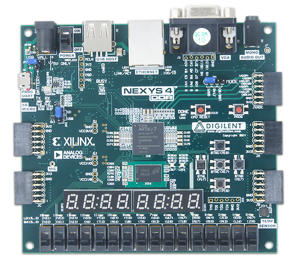
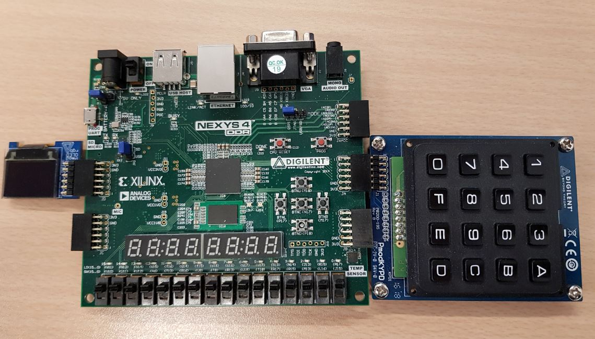

 

[**Implémentation d’un jeu de puissance 4 sur un soc reconfigurable `processeur Plasma`**](https://github.com/KHnoureddine/-Processeur-Plasma-/blob/master/DOCUMENTATION.MD)

  
  
	
  

# *`SOMMAIRE`*
- [1.Introduction:](#1Introduction)
- [2.Prérequis:](#2pr%C3%A9requis)
    - [Configuration](#configuration)
    - [Fichiers sources](#Fichiers-sources)
- [3.Utilisation:](#3Utilisation)
    - [PMOD OLED_RGB](#PMOD-OLED-RGB)
    - [PMOD KEYPAD](#PMOD-KEYPAD)    
- [4.Makefile:](#4Makefile)
    - [Build system](#Build-system)
    - [Ajout du contrôleur KEYPAD](#Ajout-du-contrôleur-KEYPAD)    
- [5.Manuel d'jeu:](#5Manuel-djeu)

## 1.Introduction:
Le présent document constitue le rapport de projet sur le cours "Système programmable sur puce reconfigurable" **EN211**, présenté ci-dessous et dénommé « Implémentation d’un jeu de puissance 4 sur un soc reconfigurable **processeur Plasma**».
Cette documentation a pour objectif de démontrer le principe de fonctionnement de notre jeu, et de détailler l'architecture du processeur Plasma lors de son utilisation.

Ce processeur a été instancié sur une puce FPGA *Artix 7* embarquée sur carte *NEXYS 4 DDR*. Il est basé sur une architecture RISC 32-bit softcore et est issu d'un projet open source : [**Plasma**](http://opencores.org/project,plasma) . L'utilisation des PMODs repose sur une interface plus flexible codée en C et faisant abstraction du langage de description VHDL.

Ce travail a été réalisé dans le cadre d'un projet encadré par Mr. **Camille LEROUX** en option **Systèmes Numériques Hétérogènes**, et élaboré par **Anas OUANNAS**, **Omar KHALIL KHEY**, et **Noureddine KHANFIR**.

Nous allons commencer, en premier lieu, par une **partie Préliminaire**, en exposant les configurations matérielles nécessaires. Ensuite, dans la partie **Utilisation**, nous allons présenter les différents contrôleurs utilisés. Finalement, nous allons clôturer cette documentation par le **Manuel du jeu**, en détaillant les règles et les démarches de notre jeu.

**[`^        back to top        ^`](#)**

## 2.Prérequis:
Ci-dessous sont listé les outils requis pour l'utilisation du processeur Plasma et les PMODs.
### Configuration
Les outils nécessaires pour l'utilisation du processeur Plasma avec les PMODs sont les suivants :
* Une carte de développement **NEXYS 4 DDR** pour implanter le processeur plasma.

  

* Un module **Pmod KEYPAD** pour permet l’utilisateur d’entrer ses choix. 
* Un module **Pmod RGB-OLED** pour afficher l’interface du jeu. 

  

* Le logiciel **VIVADO** pour le chargement du bitstream.
### Fichiers sources
`plasma.vhd` dans lequel est instancié le bloc de gestion de l'afficheur **Pmod RGB-OLED** et le clavier **Pmod KEYPAD** , les entrées/sorties et signaux pilotant le bloc y sont cablés.

`PmodKYPD.vhd` bloc principal qui permet la gestion du clavier.

`pmodoledrgb_bitmap.vhd` bloc principal qui permet de controler l'affichage Bitmap.

`main.c`( *trouvé dans le dossier `projet_e2` du répertoire `C`*) fichier en language C qui contient le corps de programme principale et les fonctions qui permette de gérer les séquences de notre jeu.

**[`^        back to top        ^`](#)**

## 3.Utilisation:
### PMOD OLED RGB

	
  

Le **PMOD_OLED_RGB** est un écran qui permet :
* L'affichage de caractères ASCII sous 8 lignes X 16 colonnes. 
* L’affichage Bitmap sous 96X64 avec 16 bits/pixel.
* L'affichage de jusqu'à 4 courbes a également été instancié.
      
L'ajout des divers modules de ce PMOD au projet repose sur le travail de [**Mr. BORNAT**](http://bornat.vvv.enseirb.fr/wiki/doku.php?id=en202:pmodoledrgb).
Pour notre projet, nous avons utilisé la configuration **OLED_RGB_Bitmap** pour afficher l’environnement graphique du jeu.   
Par la suite, nous pouvons reseter l'état de l’afficheur par l'adresse **OLED bitmap reset** (`0x400004B0`). La valeur de composant affiché est envoyée à l’adresse **OLED bitmap data** (`0x400004B8`).
Dans notre système, l’afficheur **PMOD_OLED_RGB** doit être connecté sur le port **JD**.
### PMOD KEYPAD

	
  

Le **PMOD KEYPAD** est un clavier à 16 touches au format hexadécimal (0-F). En pilotant numériquement une ligne liée à une colonne, le système peut déterminer quel bouton est actuellement appuyé.
Le fichier VHDL de ce PMOD est déjà trouvé sur le platform de [**DIGILENTIN**]( https://reference.digilentinc.com/reference/pmod/pmodkypd/start?_ga=2.151394366.661079877.1554350031-663000342.1552301098).

Le **PMOD KEYPAD** doit être relié au port **JA**. Pour assurer la bonne fonctionnement du controleur **PMOD KEYPAD**, il faut que la valeur du bouton appuyé soit trouvée à l’adresse **KEYPAD_VALUES_ADD** (`0x400004DC`), et nous avons contrôlé l’accès à cette valeur par un signal associé à l’adresse **KEYPAD_VALUES_FORCE** (`0x400004E0`).

**[`^        back to top        ^`](#)**

## 4.Makefile:
### Build system
Le build system utilisé pour le SoC Plasma repose sur le `Makefile` principal qui prend en charge l'ensemble des actions récurrentes relatives au Plasma. 
La liste des fichiers VHDL est définie avec la variable `PLASMA_SOC_FILES`, qui est utilisée pour générer les instructions de synthèse du design. 
Plusieurs paramètres peuvent être configurés au moyen de variables makes passées en argument à la commande, de même, pour activer ou désactiver la prise en charge des différents contrôleurs (qui sont tous activés par défaut) :
* CONFIG_PROJECT ?= `projet_e2`
* CONFIG_TARGET ?= `nexys4_DDR`
* CONFIG_PART ?= `xc7a100tcsg324-1`
* CONFIG_SERIAL ?= /dev/ttyUSB1
* CONFIG_UART ?= yes
* CONFIG_BUTTONS ?= yes
* `CONFIG_RGB_OLED ?= yes`
* CONFIG_SWITCH_LED ?= yes
* CONFIG_SEVEN_SEGMENTS ?= yes
* CONFIG_I2C ?= yes
* CONFIG_COPROC ?= yes
* CONFIG_VGA ?= no
* `CONFIG_KEYPAD ?= yes`

### Ajout du contrôleur KEYPAD
Afin d'ajouter **le contrôleur** au `build system`, nous avons définit :
* **Une variable de configuration associée à une valeur de generic en VHDL :**
>CONFIG_KEYPAD ?= yes 
* **Un bloc associant la configuration au generic :**
>ifeq ($(CONFIG_KEYPAD),yes)

>PLASMA_SOC_GENERICS += eKepad=1'b1

>PLASMA_SOC_FILES += PmodKYPD.vhd

>else

>PLASMA_SOC_GENERICS += eKepad=1'b0

>endif

Ensuist pur assurer la forme structurelle du processeur plasma, il faut déclarer et définir les composants utilisés, puis dans le corps de l'architecture, il suffit de les connecter.
>`component PmodKYPD` is

>Port (

>clk : in  STD_LOGIC;

>force : out  STD_LOGIC_VECTOR (31 downto 0);

>JA : inout  STD_LOGIC_VECTOR (7 downto 0);

>val: out STD_LOGIC_VECTOR (31 downto 0));

>end `component PmodKYPD;`

Le generic devra par la suite être répercuté dans les fichiers `plasma.vhd` et`top_plasma.vhd`.Sa valeur par défaut sera (à priori) placée à 1. Un bloc spécifique à l'instantiation du composant sera alors placée dans le fichier `plasma.vhd` tel que :

>**keypad_gen_enabled**: if **eKepad = '1'** `generate`

>plasma_keypad_controller: `PmodKYPD`

>`port map`(

>clk          => clk,

>force        => keypad_force,

>JA           => jA,

>val          => keypad_values);
	     
>end `generate`;

>**keypad_gen_gen_disabled**: if **eKepad = '0'** `generate`

>keypad_values <= ZERO;
    
>keypad_force <= ZERO;

>end `generate`;

#### `Remarque:` 
Il faut ajouter ` keypad_values`  et ` keypad_force`  à la liste de sensibilité de processus **misc_proc**.

Il faut affecter ces signaux à Les adresses équivalentes:
* when `x"400004DC"` => cpu_data_r <= `keypad_values`;
* when `x"400004E0"` => cpu_data_r <= `keypad_force` ;

	
  

**[`^        back to top        ^`](#)**

## 5.Manuel d'jeu:
### Pour jouer au puissance 4, il vous faut :
* Le plateau du jeu et ses **24** emplacements pour jetons répartis en **4 lignes** et **6 colonnes**.
* **24 jetons** de **2** couleurs différentes
* Être **2 joueurs** et **12 jetons** pour chacun
### Commencer une partie de puissance 4 :
Pour commencer une partie de puissance 4, on désigne le premier joueur. Celui-ci met un de ses jetons de couleur dans l’une des colonnes de son choix. Le deuxième joueur insère à son tour son jeton, de l’autre couleur dans la colonne de son choix. Le premier jeton tombe alors en bas du deuxième jeton, s’ils sont de même colonne. Et ainsi de suite jusqu’à obtenir une rangée de 4 jetons de même couleur.
### Comment gagner une partie de puissance 4 :
Pour gagner une partie de puissance 4, il suffit d’être le premier à aligner 4 jetons de sa couleur **horizontalement**, **verticalement** ou **diagonalement**.

	
  
  
  
  
  

Dans une partie, si tous les jetons sont joués **sans** qu’il y soit d’alignement de jetons, la partie est déclaré **nulle**.

	
  
  

 

**[`^        back to top        ^`](#)**
